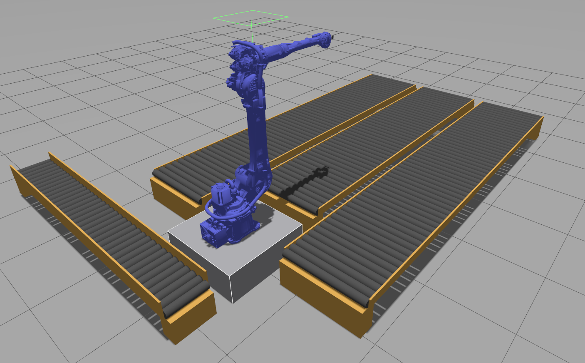

# Zero-Shot Robot Workspace

ROS 2 (Jazzy) workspace for zero-shot manipulation on a floor-mounted Yaskawa GP70L arm ("group_a": GP70L arm + Orbbec camera, picking pallets/packages off a conveyor fleet), planned with [Isaac ROS cuMotion](https://nvidia-isaac-ros.github.io/repositories_and_packages/isaac_ros_cumotion/isaac_ros_cumotion/index.html) against a shared [nvblox](https://nvidia-isaac-ros.github.io/repositories_and_packages/isaac_ros_nvblox/isaac_ros_nvblox/index.html) reconstruction, simulated in Gazebo. Longer-term goal is a diffusion-policy planner — see [docs/DIFFUSION_MODEL_IDEA.md](docs/DIFFUSION_MODEL_IDEA.md).

All development happens inside a container built via the [Isaac ROS CLI](https://nvidia-isaac-ros.github.io/concepts/dev_env/index.html) — there is no host ROS install. Design rationale (why nvblox runs in static TSDF mode, why the workspace lives inside the container) is in [docs/STRUCTURAL_DESISIONS.md](docs/STRUCTURAL_DESISIONS.md).

## Demo

[](https://youtu.be/ci6Ym74iDj0)

Zero-shot pick and place, running on its own: MobileSAM finds the box tops in the wrist camera, the arm aligns over the biggest box, a force sensor on the gripper face stops the approach on contact, and the box goes to one of three conveyors. How the vision works: [docs/VISION.md](docs/VISION.md).



The cell: a GP70L on a pedestal between two long pallet-queue conveyors and a shorter middle lane (`pallet_left`/`pallet_right`/`pallet_mid`), plus a raised `package_infeed` belt for loose items — see `src/robots/conveyor` and `src/workcell/workcell_bringup/workcell_bringup/layout.py` for the actual dimensions/clearances. A box factory (`src/robots/box_factory`) drops random boxes onto the far end of the infeed, and a laser beam near the robot end stops the line while a box waits to be picked (`workcell_bringup/launch/infeed_line.launch.py`).

## Quickstart

```bash
git clone --recurse-submodules https://github.com/Mike17K/ros2_cuda_robotic_ws.git
cd ros2_cuda_robotic_ws/src/robots/motoman_ros2_support_packages
git sparse-checkout init --cone
git sparse-checkout set motoman_gp70l_support motoman_resources
cd ../../..
bash scripts/setup_host.sh
bash scripts/build_docker_image.sh
```

`src/robots/motoman_ros2_support_packages` is Yaskawa's full multi-robot monorepo — the sparse-checkout above keeps only the GP70L description package and its shared materials, not the ~30 other robot packages it also contains. `--recurse-submodules` on its own checks out everything; the sparse-checkout step is what trims it back down.

after the build that takes about 1.5h in my pc the layered docker image will be created, and already you should be in a shell inside the container with the name admin if not just run

```bash
bash scripts/shell.sh
```

in the container run

```bash
make
source install/setup.bash
```

after you can open a new terminal and run one of the below

```bash
bash scripts/launch/launch_from_host_ws.sh       # from a host terminal (each pane docker-execs into the running container)
bash scripts/launch/launch_from_container_ws.sh  # from a shell already inside the container
```

this opens Terminator with ten panes, each with its command already typed on the prompt. Check it and press Enter, in the order of the numbers in the pane titles: 1 Workcell (Gazebo), 2 Infeed line, 3 cuMotion planner, 4 RViz, 5 Teleop UI, 6 Navigator CLI, 7 Demo. Ctrl+C on a pre-filled line skips it, and every pane leaves a ready ROS shell behind. The pane list lives in `scripts/launch/panels.sh`.

## Layout

| Path                          | What                                                                                   |
| ----------------------------- | -------------------------------------------------------------------------------------- |
| `src/workcell`                | Gazebo world + shared workcell description                                             |
| `src/robots/group_a`          | Robot description + MoveIt config for group_a (GP70L arm + Orbbec camera)              |
| `src/robots/conveyor`         | Parametric, actuated conveyor belt description + bringup, spawned per-instance         |
| `src/robots/box_factory`      | Box factory "robot": dispenser description + bringup, and the factory node that spawns random boxes (sizes, poses, textures) onto the infeed |
| `src/robots/motoman_ros2_support_packages` | Submodule (sparse), [Yaskawa-Global/motoman_ros2_support_packages](https://github.com/Yaskawa-Global/motoman_ros2_support_packages) — GP70L arm description |
| `src/workcell/workcell_teleop` | PyQt teleop UI: joint sliders, gripper toggle, conveyor speeds, Spawn Box and Box Factory controls |
| `src/planning/planning_bringup` | cuMotion planning launch/config (XRDF: `config/group_a/group_a.xrdf`)              |
| `src/planning/navigator_cli`  | Interactive pose-graph navigator (cuMotion planning + trajectory controller), plus `navigator_server`: the same navigation as ROS 2 actions |
| `src/workcell/workcell_demo`  | Orchestrator for the system's high-level behaviour - first: the infeed pick and place cycle |
| `src/shared_utils`            | Shared ROS helpers: cuMotion client, trajectory executor, TF, joint states            |
| `src/vision`                  | nvblox launch/config                                                                   |
| `src/isaac_ros_cumotion_fork` | Submodule, [Mike17K/isaac_ros_cumotion](https://github.com/Mike17K/isaac_ros_cumotion) |
| `Dockerfile.cumotion_ws`      | Layer added on top of the Isaac ROS base image                                         |
| `scripts/`                    | Entry points, see below                                                                |

## Prerequisites (host)

- [NVIDIA Container Toolkit](https://nvidia-isaac-ros.github.io/getting_started/index.html) + `isaac-ros-cli` — see `scripts/setup_host.sh`
- `docker login nvcr.io` with an [NGC API key](https://org.ngc.nvidia.com/account/api-keys) (username: `$oauthtoken`)
- `isaac_ros_common` pinned to the `3.2-15` release

Inside the container, `workcell_teleop` needs `python3-pyqt5` — `make rosdeps` should pull it in via the package's `exec_depend`, but if it doesn't resolve, `sudo apt install python3-pyqt5` by hand.

## Entry points (`scripts/`)

| Script                  | Purpose                                                                           |
| ----------------------- | --------------------------------------------------------------------------------- |
| `build_docker_image.sh` | Builds/activates the container (`isaac-ros activate --build-local`)               |
| `shell.sh`              | Opens a shell in the running container                                            |
| `entrypoint.sh`         | Container entrypoint, runs `make`                                                 |
| `setup_workspace.sh`    | First-boot dependency install inside the container                                |
| `setup_host.sh`         | One-off host setup (NVIDIA container toolkit + isaac-ros-cli)                     |
| `launch/launch_from_{host,container}_ws.sh` | Opens Terminator with the workcell / infeed line / cuMotion / RViz / nvblox / teleop / navigator / demo panes, commands pre-filled (list in `launch/panels.sh`, per-pane launcher `launch/pane.sh`) |

## Build & run (inside the container)

```bash
make            # colcon build
make rosdeps    # install rosdep dependencies
make builds n=<package>   # build a single package
```

Then, e.g.:

```bash
ros2 launch workcell_bringup workcell.launch.py sim_gazebo:=true use_fake_hardware:=false
ros2 launch planning_bringup cumotion.launch.py namespace:=robot_1 sim_gazebo:=true
ros2 launch vision nvblox.launch.py
ros2 launch workcell_bringup rviz.launch.py rviz_namespace:=robot_1
ros2 launch workcell_bringup infeed_line.launch.py   # laser beam + controller: stops the infeed while a box waits at the robot
ros2 launch workcell_teleop teleop.launch.py   # joint sliders, gripper, conveyors, spawn box, box factory, infeed line
ros2 run navigator_cli navigator_cli            # pose-graph navigator (see src/planning/navigator_cli)
ros2 launch workcell_demo demo.launch.py        # navigator action server + pick and place demo
ros2 run shared_utils cumotion_cli joints 0 -0.35 0.35 0 -0.52 0   # one-shot planner check
```

## References

- [Isaac ROS dev environment](https://nvidia-isaac-ros.github.io/concepts/dev_env/index.html)
- [Isaac ROS getting started](https://nvidia-isaac-ros.github.io/getting_started/index.html)
- [Isaac ROS cuMotion](https://nvidia-isaac-ros.github.io/repositories_and_packages/isaac_ros_cumotion/isaac_ros_cumotion/index.html)
- [Isaac ROS nvblox quickstart](https://nvidia-isaac-ros.github.io/repositories_and_packages/isaac_ros_nvblox/isaac_ros_nvblox/index.html#quickstart)
- [nvblox](https://nvidia-isaac.github.io/nvblox/v0.0.10/index.html)
- [curobo](https://nvlabs.github.io/curobo/latest/getting-started/installation.html)
- [Isaac Sim quick install](https://docs.isaacsim.omniverse.nvidia.com/latest/installation/quick-install.html#isaac-sim-quick-install)
- [Isaac Sim robot config generator (Lula)](https://docs.isaacsim.omniverse.nvidia.com/6.0.1/robot_setup_tutorials/tutorial_generate_robot_config.html)
- [direnv](https://direnv.net/)
